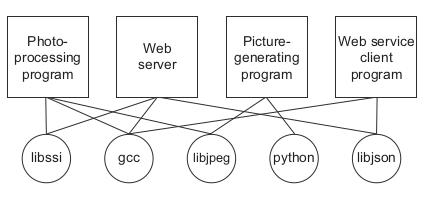

## Quels problèmes Docker résoud ##

### L'organisation des applications ###

L'utilisation des logiciels est complexe. Avant l'installation, vous devez considérer quel système d'exploitation, les ressources requises par le logiciel, les autres logiciels déjà utilisés installé, et de quels autres logiciels il dépend. Vous devez décider où il doit être installé. Vous devez alors savoir comment l'installer. Il est surprenant de constater à quel point les processus d'installation varient aujourd'hui. La liste des considérations est longue et impitoyable.

L'installation de logiciels est au mieux incohérente et trop compliquée.
La plupart des ordinateurs ont plus d'une application installée et en cours d'exécution. Et la plupart de ces applications ont des dépendances avec d'autres logiciels. Que se passe-t-il lorsque deux ou plusieurs applications que vous voulez utiliser ne vont pas ensemble ? Désastre. Les choses sont compliqués lorsque deux applications demandes partagent des dépendances :

* Que se passe-t-il si une application a besoin d'une dépendance améliorée mais que l'autre n'en a pas besoin ?
* Que se passe-t-il lorsque vous désintallez une de ces applications? Est-elle vraiment supprimée ?
* Pouvez-vous supprimer d'anciennes dépendances ?
* Pouvez-vous vous souvenir de toutes les modifications que vous avez dû apporter pour installer le logiciel que vous voulez maintenant supprimer ?

### La portabilité ###

Un autre problème de logiciel est que les dépendances d'une application comprennent généralement un
système d'exploitation spécifique. La portabilité entre les systèmes d'exploitation est un problème majeur
pour les utilisateurs de logiciels. Bien qu'il soit possible d'avoir une compatibilité entre les logiciels Linux et Mac OS X , l'utilisation de ce même logiciel sous Windows peut être plus difficile. Pour ce faire peut nécessiter la construction de versions complètes portées du logiciel. Même cela n'est possible que si des dépendances de remplacement appropriées existent pour Windows. Cela représente une pour les responsables de l'application et est souvent ignorée. Malheureusement, pour les utilisateurs, toute une série de logiciels puissants est trop difficile ou impossible à utiliser sur leur système.
Actuellement, Docker fonctionne en natif sur Linux et est livré avec une seule machine virtuelle
pour les environnements OS X et Windows. Cette convergence sur Linux signifie que les logiciels qui circulent dans les conteneurs Docker ne doivent être écrites qu'une seule fois par rapport à un ensemble cohérent de dépendances.

### La sécurité ###

La vérité toute simple est que plus vous utilisez de logiciels, plus ils sont difficiles à gérer.
Même si vous pouvez consacrer le temps et l'énergie nécessaires à l'installation.Si vous utilisez des applications, quelle confiance pouvez-vous avoir dans votre sécurité ?
Qu'ils soient à code source ouvert ou fermé, les programmes  publient continuellement des mises à jour de sécurité, et en étant conscient qu'il est quasi impossible de couvrir toutes les failles. Plus vous utilisez de logiciels, plus vous êtes vulnérables aux attaques.

Aussi les conteneurs nous protègent aussi des logiciels qui tournent à l'intérieur d'un conteneur.
il y a plusieurs manières dont un programme pourrait mal se comporter ou présenter un risque pour la sécurité :

* Un programme peut avoir été écrit spécifiquement par un black hacker.
* Des développeurs bien intentionnés pourraient écrire un programme avec des bogues nuisibles.

Comme les cellules de prison, tout ce qui se trouve à l'intérieur d'un conteneur ne peut accéder qu'aux objets qui s'y trouvent également. Il existe des exceptions à cette règle, mais uniquement lorsqu'elles sont explicitement créées par l'utilisateur. Les conteneurs limitent l'impact qu'un programme peut avoir sur les autres programmes en cours, les données auxquelles il peut accéder et les ressources du système

Source: Docker in Action,Jeff Nickoloff 

https://geekflare.com/docker-architecture/