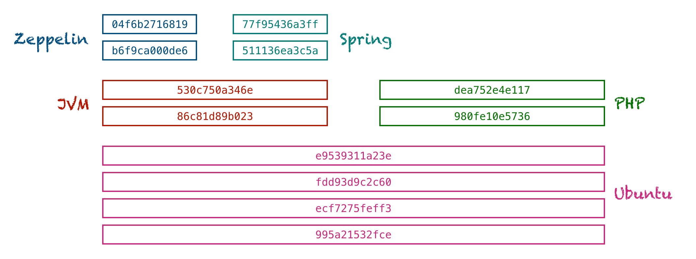

# Les namespaces et les Cgroups #

Docker réalise l'isolation de différents conteneurs grâce à la combinaison de 3 concepts principaux :

* les cgroup
* les namespaces
* les couches d'images empilables et le copy-on-write (Cow)

Les **cgroup et namespaces** sont des fonctionnalités du noyau Linux pour assurer l’isolation des containers.

## Les namespaces ##

Les namespaces permettent d’isoler le point de vue d’une application de l’environnement : process trees network, les systèmes de fichiers et les user’s ID. Autrement dit, les namespaces permettent de limiter ce que peut voir l’application, ou plus généralement ils permettent de séparer les ressources du noyau tel qu’un ensemble de processus voit un ensemble de ressources tandis qu’un autre ensemble de processus verra un ensemble de ressources différent.
Différents namespaces

Il existe de multiple namespaces (pid, net, mnt, uts, ipc, user) qui permettent de créer plusieurs groupes d’isolation. Chaque processus appartient à un namespace de chaque type, et les namespaces peuvent être imbriqués les un dans les autres.
Ils sont matérialisés par des pseudo-files lister dans /proc/<pid>/ns, ce qui nous permet, pour un <pid> donné, de lister ses namespaces par la commande ls /proc/<pid>/ns -ail.
Il est aussi possible de lister les namespaces de chaque processus avec la commande lsns -l, dont les namespace apparaissent dans la colonne NS et dont le type (user, pid …) est renseigné dans le champs TYPE. Pour lister tout les processus appartenant à un type de namespace donné, il suffit de le spécifier dans la commande, par exemple si je veux lister tout les namespaces de type user, je peux utiliser la commande lsns -t user, et en règle générale utiliser la commande lsns -t <type>, où <type>doit être mnt, net, ipc, user, pid, uts ou cgroup. Il est donc aussi possible de lister les cgroups par la commande lsns -t cgroup.
Un namespace est créer avec l’appel système clone(), en ajoutant des flags quand on crée un nouveau processus. Il est aussi possible de créer un namespace par la commande setns(). Quand le dernier processus d’un namespace se termine, le namespace est détruit. Chaque processus appartient à un namespace de chaque type.
Voyons les principaux namespaces et leurs utilités:

* Pid Namespace: permet d’isoler l’ ID number space, impliquant que des processus dans différents PID namespaces peuvent avoir le même PID. Chaque processus a son propre identifiant, commençant à 1. Si le processus numéro 1 termine, tout le namespace est tué. Ces namespaces peuvent être imbriqué, donc une processus aura de multiple PID, un pour chaque namespace dans lequel il est imbriqué. 
* User Namespace: il permet d’isoler (pour la sécurité) les identifiants et les attributs, en particulier les user ID et les group ID (voir credentials(7)), le répertoire root, les keys (voir keyrings(7)) et les capabilities (voir capabilities(7)). Les user ID et group ID d’un processus peuvent être différents à l’intérieur et à l’extérieur dans user namespace. Un processus a donc des droits différents en fonction du namespace.
*  Network Namespace: chaque network namespace a sa propre network stack, iptables rules, tables de routage (routing tables), ses règles pour le pare-feu, et ses périphériques réseaux. Il est possible de créer un network namespace grâce à la commande : $ ip netns add ns1 qui crée un nouveau namespace nommé ns1. Il est alors possible de lister les namespaces disponible dans le système avec la commande $ ls /var/run/netns ou $ ip netns.
* Mount Namespace: fourni une isolation de la liste des points de montage (mount points) vu par les processus en fonctionne de leurs mnt namespace. Chaque processus verront donc des arborescences de répertoire propre à leurs namespaces. Il est possible d’attacher un processus à son filesystem par la commande chroot par exemple.
* IPC Namespace: chaque IPC namespace a son propre ensemble d’identifiants System V IPC et ses propres POSIX message queue filesystem.
* UTS Namespace: permet d’isoler deux éléments du système en leurs donnant différents host et domain names (nom de domaine). 

## Les « Control Groups » : cgroups ##

Les cgroups sont une fonctionnalité du noyau Linux qui permettent de limiter, compter et isoler l’utilisation des ressources (processeur, mémoire, utilisation disques ..).

Il est donc possible de mettre en place différents cgroups pour limiter l’utilisation CPU et de la mémoire (y compris le cache du système de fichier) pour un ensemble de processus donné. Ils permettent donc la priorisation, c’est-à-dire que certains groupes peuvent obtenir une plus grande part de ressource processeur ou de bande passante d’entré/sortie, mais aussi de mesurer la quantité de ressources consommées par certains systèmes. On peut aussi figer les groupes ou créer un point de sauvegarde et redémarrer.

Pour créer un cgroup, utilisez la commande suivante : cgcreate -g subsystems:path où l’option -g spécifie la hiérarchie dans laquelle le cgroup dois être créer. Par exemple, le cgroup qui se trouve dans /cgroup/cpu/cg1, créer avec la commande cgcreate -g cpu:/cg1 s’appelle juste cg1.

L’isolation est fourni par les namespaces qui empêchent un groupe donné de processus de voir les processus des autres groupes, leurs connexions réseaux et leurs fichiers.

Nous avons donc vu à travers cet article le principe de containérisation, ce qu’est un container et à quoi cela sert, mais aussi comment les cgroups et les namespaces nous permettent d’isoler ce que peut voir chaque containers, mesurer leur utilisation des ressources et les isoler des autres containers.

<http://jpetazzo.github.io/2013/10/08/docker-containers-metrics/>

## Couches d'images empilables et le Copy-on-Write (CoW) ##

Pour mieux comprendre comment l'isolement des ressources matérielles et des systèmes nous aide à construire des conteneurs, nous allons examiner la façon dont Docker stocke les images. Comme nous l'avons vu précédemment, une image Docker est comme le plan d'un conteneur. Elle est accompagnée de toutes les dépendances nécessaires au démarrage de l'application qu'elle contient. Mais comment ces dépendances sont-elles stockées ?

Docker conserve les images dans des couches empilables. Une couche contient les modifications apportées à la couche précédente. Si, par exemple, vous installez d'abord Python puis copiez un script Python, votre image aura deux couches supplémentaires : Une contenant les exécutables Python et une autre contenant le script. L'image suivante montre un Zeppelin, un Spring et une image PHP, tous basés sur Ubuntu.

Afin de ne pas stocker Ubuntu trois fois, les couches sont immuables et partagées. Docker utilise le copy-on-write pour ne faire une copie d'un fichier que s'il y a des modifications.

Lorsqu'il démarre un conteneur basé sur une image, le démon Docker vous fournit toutes les couches contenues dans cette image et le place dans un espace de noms de système de fichiers isolé pour ce conteneur. La combinaison de couches empilables, de copie en écriture et d'espaces de noms de systèmes de fichiers vous permet d'exécuter un conteneur complètement indépendant des choses "installées" sur l'hôte du Docker sans perdre beaucoup d'espace. C'est l'une des raisons pour lesquelles les conteneurs sont plus légers que les machines virtuelles.

REference: <http://sysblog.informatique.univ-paris-diderot.fr/2019/03/08/containerisation-cgroups-namespace/#:~:text=Les%20namespaces%20%26%20cgroups,une%20seul%20instance%20de%20Linux.>

http://jpetazzo.github.io/2014/06/23/docker-ssh-considered-evil/

http://sysblog.informatique.univ-paris-diderot.fr/2019/03/10/docker-securite/

http://jpetazzo.github.io/2013/10/08/docker-containers-metrics/

https://github.com/baghorsoufiane/docker

plus: https://www.youtube.com/watch?v=sK5i-N34im8

http://sysblog.informatique.univ-paris-diderot.fr/2019/03/08/docker-facile-en-7-etapes/