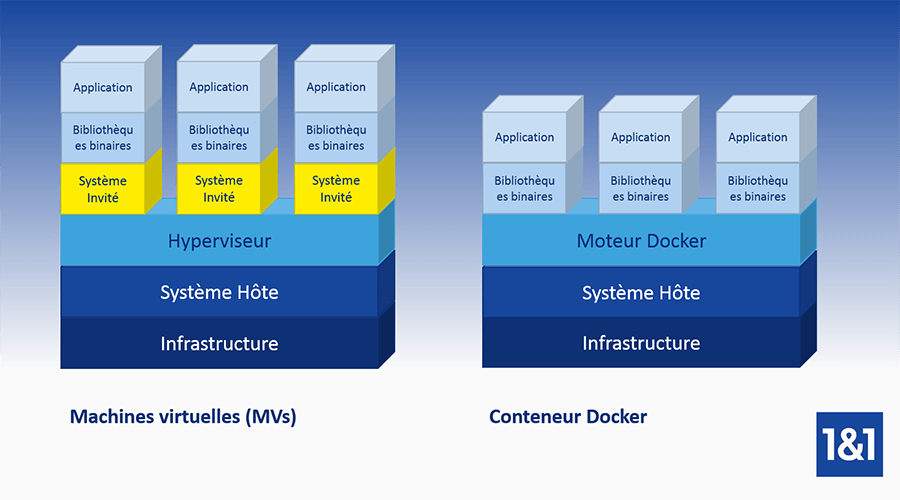

# Différences entre la virtualisation et la conteneurisation #

La virtualisation est l’abstraction des ressources informatiques physiques telles que le matériel, les logiciels, le stockage et les composants réseau. L’objectif est de mettre ces ressources à disposition de manière virtuelle et de les distribuer à différents clients de manière flexible et suivant la demande. La méthode vise à améliorer l’utilisation des ressources informatiques.

Le terme « virtualisation » a été inventé dans les années 1960 et faisait initialement référence à la conception de machines virtuelles, un concept donc orienté hardware. Aujourd’hui dans le paysage informatique moderne, on trouve diverses formes de virtualisation qui se réfèrent à l’abstraction des ressources informatiques telles que les logiciels, la mémoire, les données ou les composants réseau. Une distinction est donc faite entre :

* Virtualisation matérielle
* Virtualisation logicielle
* Virtualisation de la mémoire
* Virtualisation des données
* Virtualisation du réseau

Nous nous intéresserons à la virtualisation matérielle et logicieille.

## La virtualisation matérielle ##

Le terme de virtualisation hardware ou matérielle désigne les technologies qui permettent de fournir des composants matériels à l’aide de logiciels, quelle que soit leur base physique. L’exemple classique d’une virtualisation matérielle est la machine virtuelle (abrégé VM en anglais).

Une VM est une machine virtuelle qui se comporte pour l’utilisateur final comme une machine physique, y compris avec un matériel et un système d’exploitation. Elle fonctionne sur un ou plusieurs systèmes physiques appelés hôtes. Avec la virtualisation matérielle, la couche d’abstraction entre la base physique et le système virtuel est créée par un hyperviseur.

Un hyperviseur (aussi appelé Virtual Machine Monitor, soit VMM) est un logiciel qui permet à plusieurs systèmes invités de fonctionner sur un seul système hôte. Il existe deux types différents d’hyperviseurs. Il existe:

* l’hyperviseur de type 1 qui est basé directement sur le matériel du système hôte et qui sont dits « natifs ».
* Les hyperviseurs de type 2, par contre, fonctionnent dans le système d’exploitation de l’hôte et utilisent les pilotes périphériques fournis par le système pour accéder au matériel.

Ainsi ces machines virtuelles nommées aussi VM (Virtual Machine) bénéficieront de ressources matérielles selon leurs besoins (par exemple plus de puissance processeur et plus de mémoire vive mais avec moins d’espace disque). L'avantage c'est qu'il est possible de modifier les ressources physiques de ces VMs en quelques clics. De plus elles possèdent leur propre système d’exploitation ainsi que leurs propres applications.

Les hyperviseurs gèrent les ressources matérielles fournies par le système hôte, telles que le CPU, la RAM, l’espace disque et les périphériques, et les répartissent entre plusieurs systèmes invités.

Pour l’utilisateur final, la machine virtuelle ne se distingue pas d’une machine physique. La virtualisation matérielle est donc une question de choix lorsqu’il s’agit de fournir une variété de serveurs virtuels pour différents utilisateurs sur une plateforme informatique puissante - la base du modèle largement répandu d’hébergement mutualisé.

## La virtualisation logicielle ##

Si des composants logiciels sont virtualisés au lieu de composants matériels, on parle de virtualisation logicielle. Les approches communes de ce concept de virtualisation sont :

* virtualisation des applications
* virtualisation de postes de travail
* Virtualisation sur les systèmes d’exploitation

### La virtualisation des applications ###

La virtualisation des applications est l’abstraction d’applications individuelles du système d’exploitation sous-jacent. Les systèmes de virtualisation d’applications tels que VMware ThinApp, Microsoft App-V ou Citrix XenApp permettent aux programmes de s’exécuter dans des environnements d’exécution isolés et de se répartir sur plusieurs systèmes sans avoir à modifier les systèmes d’exploitation locaux, les systèmes de fichiers ou le registre.

### La virtualisation des postes de travail ###

La virtualisation des postes de travail est un concept dans lequel les environnements de bureausont fournis de manière centralisée et accessibles via un réseau. Cette approche s’applique principalement dans un contexte d’entreprises.

### La virtualisation au niveau du systeme d'exploitation ###

Les concepts de virtualisation au niveau du système d’exploitation s’appuient sur les fonctions natives du noyau des systèmes d’exploitation unix, qui permettent d’exécuter plusieurs instances d’espace utilisateur isolées en parallèle. Contrairement à la virtualisation matérielle, aucun système invité complet, y compris le noyau, n’est reproduit. Au niveau du système d’exploitation, les applications virtualisées partagent le noyau du système hôte.
Chaque instance d’espace utilisateur représente un environnement d’exécution virtuel autonome appelé container, partition, moteur de virtualisation ou jail, selon la technologie utilisée.

Les instances d’espace utilisateur sont virtualisées à l’aide de mécanismes chroot natifs fournis par tous les systèmes d’exploitation unix. Chroot (abréviation de « change root ») est une commande système qui permet de changer le répertoire racine d’un processus en cours. Les processus qui sont déplacés dans un répertoire racine virtuel peuvent accéder aux fichiers de ce répertoire si l’implémentation est correcte. Cependant, le chroot seul ne suffit pas. Bien que la commande système offre des capacités de virtualisation de base, il n’a jamais été conçu comme un concept de protection de processus. Les technologies de conteneurs combinent donc chroot avec d’autres fonctions natives du noyau comme Cgroups et Namespaces pour fournir aux processus un environnement d’exécution isolé avec un accès limité aux ressources matérielles. On parle de processus conteneurisés.

* Cgroups : il s’agit de groupes de contrôle de gestion des ressources qui permettent de limiter l’accès des processus aux ressources matérielles.
* Namespaces : il s’agit d’espaces de noms pour l’identification des systèmes et des processus ainsi que pour les communications interprocess et pour les ressources réseau. Les espaces de noms peuvent être utilisés pour restreindre un processus et ses processus fils à une section souhaitée du système sous-jacent.

Un conteneur logiciel contient une application comprenant toutes les dépendances telles que les bibliothèques, les programmes d’aide ou les fichiers de configuration. Les applications conteneurisées peuvent être transférées d’un système à l’autre sans configuration ultérieure.

Crédit image: IONOS 1&1
