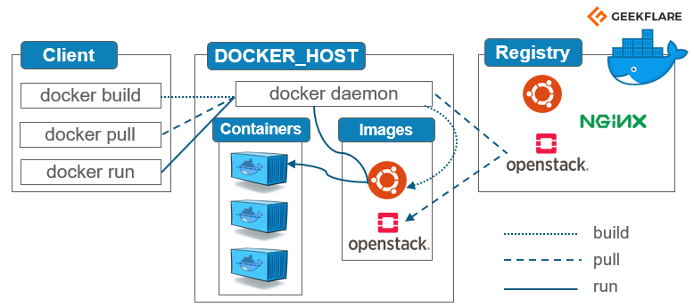

# Installation et post installation de docker CE #

## Installation ##

Nous allons installer Docker Community Edition

Pour installer docker, il faut se referer à la documentation officielle.
Voici les liens pour l'installation sous:

* Ubuntu: <https://docs.docker.com/engine/install/ubuntu/>

* Debian: <https://docs.docker.com/engine/install/debian/>

* Fedora <https://docs.docker.com/engine/install/fedora/>

* CentOS: <https://docs.docker.com/engine/install/centos/>

## Post installation - Hello World ##

Une fois l"installation terminée, nous allons vérifier avec un "hello world"

```bash
sudo docker run hello-world
```

On a le résultat suivant la 1ère fois

```bash

Unable to find image 'hello-world:latest' locally
latest: Pulling from library/hello-world
0e03bdcc26d7: Pull complete
Digest: sha256:d58e752213a51785838f9eed2b7a498ffa1cb3aa7f946dda11af39286c3db9a9
Status: Downloaded newer image for hello-world:latest

Hello from Docker!
This message shows that your installation appears to be working correctly.

To generate this message, Docker took the following steps:
 1. The Docker client contacted the Docker daemon.
 2. The Docker daemon pulled the "hello-world" image from the Docker Hub.
    (amd64)
 3. The Docker daemon created a new container from that image which runs the
    executable that produces the output you are currently reading.
 4. The Docker daemon streamed that output to the Docker client, which sent it
    to your terminal.

To try something more ambitious, you can run an Ubuntu container with:
 $ docker run -it ubuntu bash

Share images, automate workflows, and more with a free Docker ID:
 https://hub.docker.com/

For more examples and ideas, visit:
 https://docs.docker.com/get-started/
```

Ce petit message nous donne une petite explcation sur le client Docker.
A chaque "run", le client sollicite le daemon docker qui:

1. vérifie si l'image à exécuter est présente en local, sinon
2. le daemon télécharge l'image à partir du Docker Hub
3. Ensuite, le daemon crée un nouveau container à partir de l'image

## Architecture Docker ##



Le moteur Docker est une application client-serveur avec ces composants majeurs :

* Un serveur qui est un type de programme de longue durée appelé "daemon process" (la commande dockerd).
* Une API REST qui spécifie les interfaces que les programmes peuvent utiliser pour parler au démon et lui indiquer ce qu'il doit faire.
* Un client d'interface de ligne de commande (CLI) (la commande docker).


Le CLI utilise l'API REST du Docker pour contrôler ou interagir avec le démon du Docker par le biais de scripts ou de commandes CLI directes. De nombreuses autres applications du Docker utilisent l'API et la CLI sous-jacentes.

Le démon crée et gère les objets du Docker, tels que les images, les conteneurs, les réseaux et les volumes.

### Permette à mon user d'appeler docker sans sudo ###

 Par défaut on ne peut lancer les commandes docker qu'avec l'utilisateur root et les autres utilisateurs ne peuvent y accéder qu'en utilisant le sudo.

En ce qui me concerne et pour la suite de ce cours, je vais autoriser mon compte utilisateur Unix à lancer les commandes docker sans passer par le sudo. Donc à partir de maintenant je ne vais plus utiliser le sudo dans mes exemples, sauf si obligation.

```bash
sudo groupadd docker

sudo usermod -aG docker $USER
```

Après redemarrage de la machine, vous verrez l'apparition d'une interface réseau (docker0 dans mon cas) .
on peut aussi vérifier si nous pouvons utiliser docker sans sudo:

```bash
docker ps
# Sans sudo
```

<https://www.linkedin.com/pulse/docker-les-principaux-composants-anthony-bondu/>
