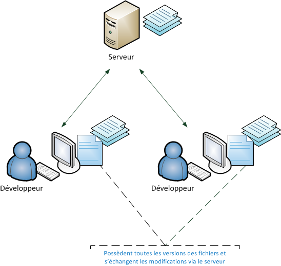

# Git, kezako #

Vous avez peut-être entendu parler de Git, le nouveau logiciel merveilleux qui remet le plaisir dans le travail laborieux du contrôle de version.

A quoi sert vraiement un logiciel de controle de version?
Si vous continuez de lire cet article, il y'a de fortes chances que pour votre travail, vous devez:

* créer des fichiers,
* ajouter du contenu aux fichiers,
* sauvegarder,
* modifier le contenu,
* sauvegarder le fichier,
* remodifier le fichier,
* sauvegarder  le fichier jusqu'à ce qu'à la suppression du fichier

Lorsqu'on sauvegarde un fichier, l'ancienne version est en fait écrasé. On a accès à la dernière version du fichier. Et si on veut avoir accès à l'avant dernière version de notre fichier, comment s'y prendre? Nous sommes obligés de nous rappeler des changements effectués pour les supprimer dans les fichiers.

Cela peut paraitre simple ou non selon la mémoire de chacun. Avec les logiciels de controles de version on peut revenir à la version qu'on veut.

Un autre problème que les systèmes de controles de version résolvent c'est le souci dans la collaboration.Si vous avez déjà travaillé sur un projet informatique, que ce soit un petit projet personnel ou un plus gros projet professionnel, vous avez certainement déjà rencontré un de ces problèmes :

* « Qui a modifié le fichier X, il marchait bien avant et maintenant il provoque des bugs ! » ;

* « Robert, tu peux m’aider en travaillant sur le fichier X pendant que je travaille sur le fichier Y ? Attention à ne pas toucher au fichier Y car si on travaille dessus en même temps je risque d’écraser tes modifications ! » ;

* « Qui a ajouté cette ligne de code dans ce fichier ? Elle ne sert à rien ! » ;

* « À quoi servent ces nouveaux fichiers et qui les a ajoutés au code du projet ? » ;

* « Quelles modifications avions-nous faites pour résoudre le bug de la page qui se ferme toute seule ? »

Ce sont entre autre quelques problèmes que les logiciels de gestion de version résolvent.
Ces logiciels ont donc par conséquent deux utilités principales :

* suivre l’évolution d’un code source, pour retenir les modifications effectuées sur chaque fichier et être ainsi capable de revenir en arrière en cas de problème ;

* travailler à plusieurs, sans risquer de se marcher sur les pieds. Si deux personnes modifient un même fichier en même temps, leurs modifications doivent pouvoir être fusionnées sans perte d’information.

Pour chaque document, on saura donc:

* Quand le fichier a t-il été modifié
* Qu'est ce qui a changé
* Pourquoi ça a été modifié

(En anglais, ça donne When, What, Why soit un triple W)

Il existe 2 types principaux de logiciels de gestion de version:

* Les logiciels centralisés : un serveur conserve les anciennes versions des fichiers et les développeurs s’y connectent pour prendre connaissance des fichiers qui ont été modifiés par d’autres personnes et pour y envoyer leurs modifications.

* Les logiciels distribués : il n’y a pas de serveur, chacun possède l’historique de l’évolution de chacun des fichiers. Les développeurs se transmettent directement entre eux les modifications, à la façon du peer-to-peer. Dans la pratique, les logiciels distribués sont rarement utilisés comme sur le schéma précédent. Même lorsque les logiciels sont capables de fonctionner en mode distribué, on utilise très souvent un serveur qui sert de point de rencontre entre les développeurs. Le serveur connaît l’historique des modifications et permet l’échange d’informations entre les développeurs, qui eux possèdent également l’historique des modifications.

Crédit image: Openclassrooms
