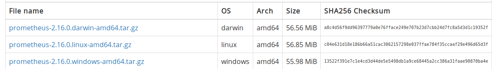

# Installation de Prometheus #

## Installation sous CentOS 7 Linux

Note: Ce tuto a été testé avec CentOS mais devrait marcher sur Ubuntu/Debian avec une différence au niveau de l'ajout des règles de firewall

*Téléchargement de l'archive de Prometheus*  

On se rend sur le site officiel de prometheus,la page download et copie l'URL
de l'archive "tar".


Au moment de rédaction de ce tutoriel,la version à jour est la 2.16
<pre><code>https://github.com/prometheus/prometheus/releases/download/v2.16.0/prometheus-2.16.0.linux-amd64.tar.gz</code></pre>

*Configuration de Prometheus*  

Nous allons créer un utilisateur prometheus
```bash
useradd --no-create-home --shell /bin/false prometheus
```
*Création des repertoires utiles*  

```
mkdir /etc/prometheus
```

```
mkdir /var/lib/prometheus
```

Nous devons maintenant changer le propriétaire des repertoires créés
```
chown prometheus:prometheus /etc/prometheus
```

```
chown prometheus:prometheus /var/lib/prometheus
```
On se rend maintenant dans le dossier de téléchargement de Prometheus pour extraire les fichiers  
```
tar -xvzf prometheus-2.16.0.liux-amd64.tar.gz
```

Pour une manipulation facile, on peut renommer le dossier(optionel car on peut tout aussi utiliserr TAB pour taper les noms plus facilement)
```
mv prometheus-2.16.0.linux-amd64 prometheus
```

On copie les fichiers binaires "prometheus" et "promtool" vers le dosier "/usr/local/bin"
local/bin/"
```
cp prometheus/prometheus /usr/local/bin/
```

```
cp prometheus/promtool /usr/local/bin/
```

On copie les repertoires "consoles" et "console_libraries" dans le dossier "/etc/prometheus"  

```
cp -r prometheus/consoles /etc/prometheus
```
```
cp -r prometheus/console_libraries /etc/prometheus
```

On change le propriétaire des repertoires créés
```
chown -R prometheus:prometheus /etc/prometheus/consoles
```

```
chown -R prometheus:promethues /etc/prometheus/console_libraries
```

On crée le fichier de configuration principal de Prometheus (prometheus.yml)dans le répertoire "/etc/prometheus"
```
vi /etc/prometheus/prometheus/yml
```

```
global:
  scrape_interval: 10s

scrape_configs:
  - job_name: 'prometheus_master'
    scrape_interval: 5s
    static_configs:
      - targets: ['localhost:9090']
```

On sauvegarde les changements et on sort du fichier.   
On crée maintenant le fichier du service Prometheus  
```
vim /etc/systemd/system/prometheus.service
```
On copie le contenu suivant dans le fichier

```
[Unit]
Description=Prometheus
Wants=network-online.target
After=network-online.target

[Service]
User=prometheus
Group=prometheus
Type=simple
ExecStart=/usr/local/bin/prometheus \
--config.file /etc/prometheus/prometheus.yml \
--storage.tsdb.path /var/lib/prometheus/ \
--web.console.templates=/etc/prometheus/consoles \
--web.console.libraries=/etc/prometheus/console_libraries
```

On sauvegarde le fichier et on ressort.   
On peut maintenant recharger le service   
```
systemctl daemon-reload
```

On peut demarrer le service Prometheus  
```
systemctl start prometheus
```

On vérifie l'état du service

```
systemctl status prometheus
```

Si le service n'a pas démarré, il y a de fortes chances qu'il y ait une erreur de syntaxe dans le fichier "prometheus.yml".   
On peut vérifier les erreurs avec la commande suivante:   
```
/usr/local/bin/promtool check config /etc/prometheus/prometheus.yml
```


On peut maintenant activer le démarrage automatique du service
```
systemctl enable prometheus
```

Si firewalld est activé, il faut ajouter les règles de firewall
```
firewall-cmd --zone=public --add-port=9090/tcp --permanent
 ```

On recharge firewalld

```
systemctl reload firewalld
```

*Accéder à l'interface Web de Prometheus*

Le port par défaut de Prometheus est 9090

On se rend dans la barre d'addresse de notre navigateur Web et on tape : https://ADRESSE_IP_DU_SERVEUR:9090

[!Interface de Prometheus](prometheus_accueil.jpg)


