## Préparer le système ##

### Installation de Terraform ###
Pour débuter nous devons au préalable installer Terraform.  

Terraform est disponible à la fois pour Windows, Linux, MacOS, FreeBSD, OpenBSD et Solaris. Vous pouvez suivre la documentation officielle pour l'installation [ici](https://learn.hashicorp.com/tutorials/terraform/install-cli)  


### Génerer les Accès AWS IAM ###

Nous avons installé Terraform. Cependant comment terraform construira l'infrastrucutre sans permission chez AWS? Pour régler ce point, nous avons besoin de générer:
- AWS_ACCESS_KEY_ID
- AWS_SECRET_ACCESS_KEY

Ces deux accès peuvent être définis sur notre machine en tant que variable d'environnement 

Comment obtenir ces 2 éléments?  
Etape 1: Se connecter à notre console AWS et chercher IAM
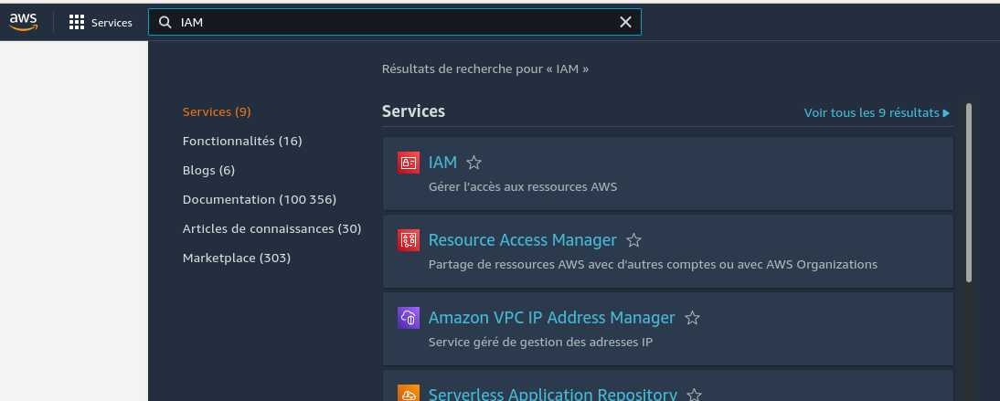  

Etape 2: Chercher Utilisateurs
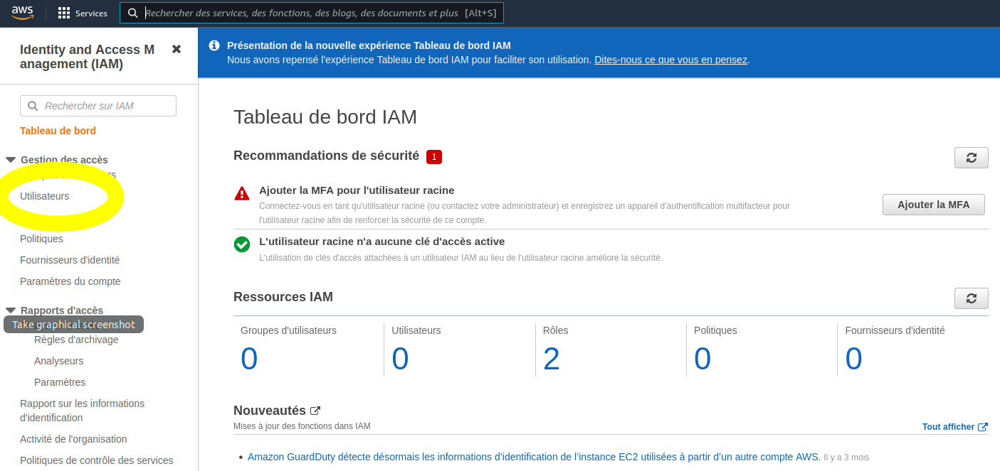  

Etape 3: Créer l'utilisateur et sélectionner le type d'accès
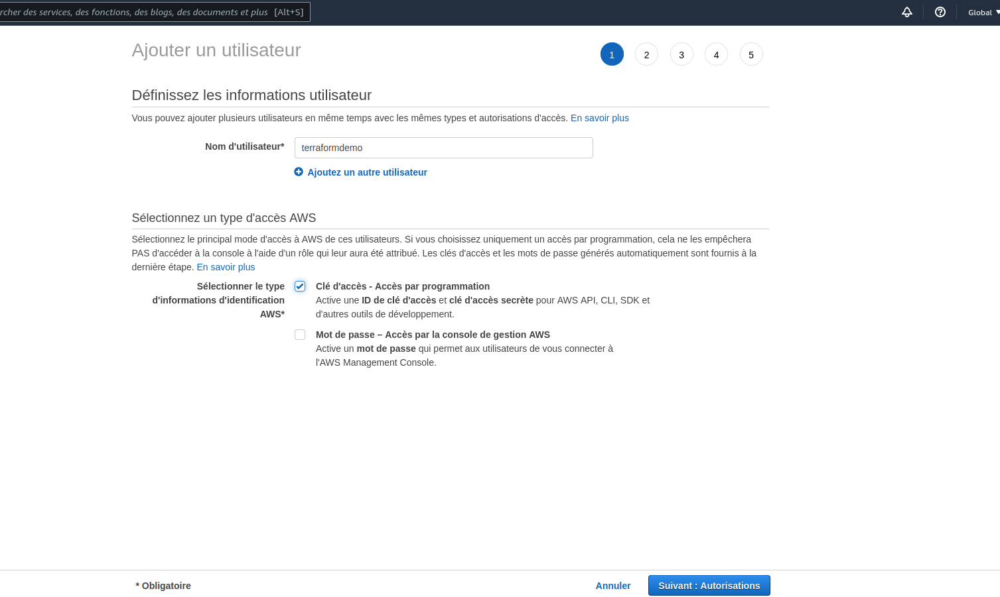  


Etape 4: Donner les permissions 
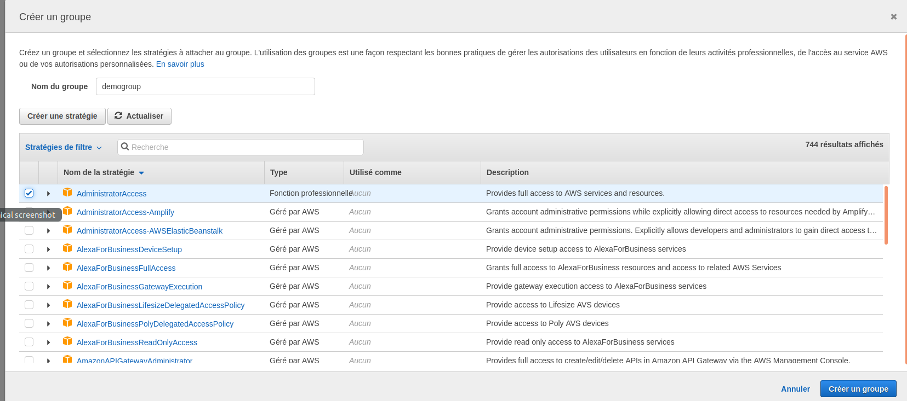  
Pour simplifier ce tutoriel, nous avons donné les permissions d'Admin. Pour un projet plus professionnel, vous pouvez suivre le principe du 'least privilege', voir plus [ici](https://docs.aws.amazon.com/IAM/latest/UserGuide/best-practices.html#grant-least-privilege)

Etape 5: Résumé
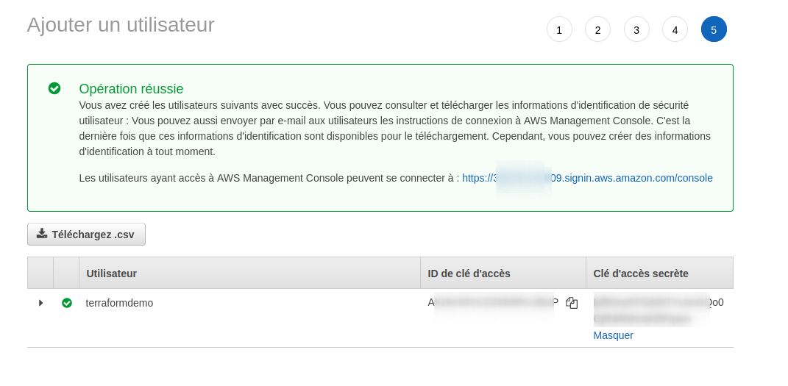  

## Initialisation du projet et Authentification ##


Nous allons maintenant écrire nos configurations Terraform. Je vous suggère de créer un dossier pour cela

```bash
mkdir terraform-lab
```

```
cd terraform-lab
```

Nous créons maintenant le fichier pour le provisionnement de notre ressource. Le code terraform est écrit dans des fichiers texte avec l'extension .tf
Il existe aussi une version JSON qui a l'extension .tf.json mais nous nous focalisons sur le premier format pour le moment.

```bash
vim server.tf
```

```bash
provider "aws" {
  access_key = "ABCDE12345"
  secret_key = "ABCDEFGH123456789"
  region     = "us-east-1"
}

resource "aws_instance" "demo" {
  ami           = "ami-0a3c14e1ddbe7f23c"
  instance_type = "t2.micro"
}
```

Explication du code: 
- Terraform s'appuie sur des plugins appellés "providers" pour interagir avec les systèmes distants.  
Le provider est défini grace au block "provider". Dans notre cas, il s'agit de [AWS](https://registry.terraform.io/providers/hashicorp/aws/latest/docs). L'utilisation de ce provider nécessite de déclarer trois éléments: Le secret_key, le access_key et la région par défaut  (us-east-1 dans notre cas).
- La ressource à créer est une instance ec2 qui aura pour nom "demo". L'AMI et le type de Ec2 sont visibles dans l'interface graphique de AWS

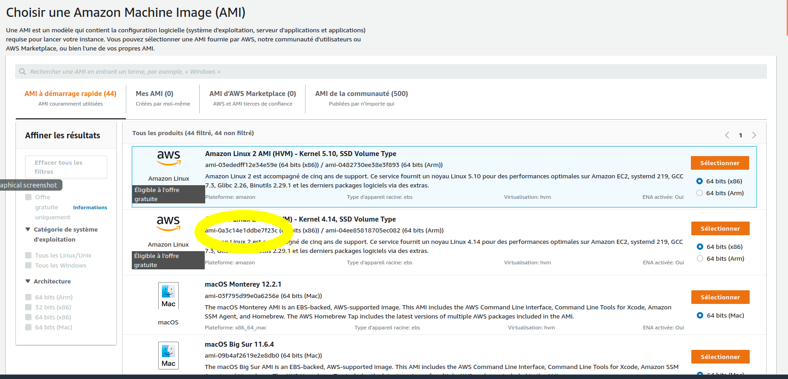

### Création de l'instance ###

une fois le code écrit, nous pouvons passer à la suite.
La prochaine étape du [workflow terraform](ttps://www.terraform.io/intro/core-workflow) consiste à lancer la commande terraform init...

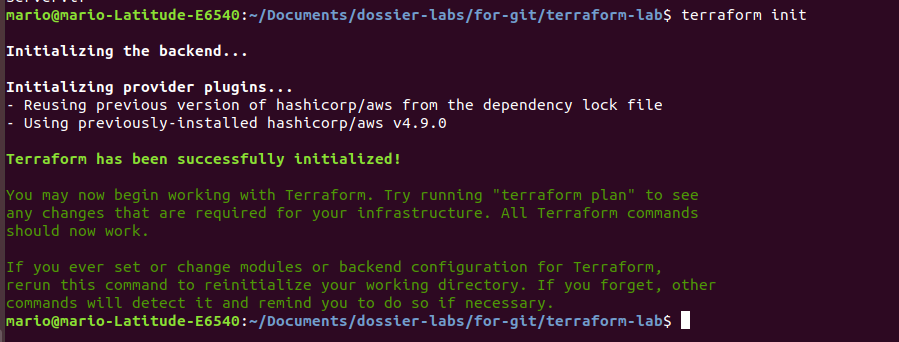

suvi de la commande terraform plan...

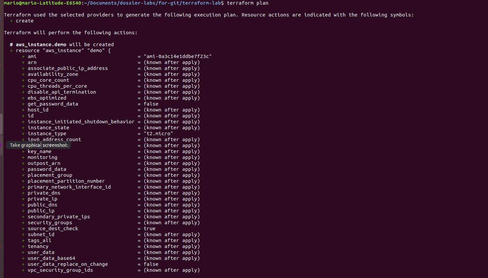

puis terraform apply.

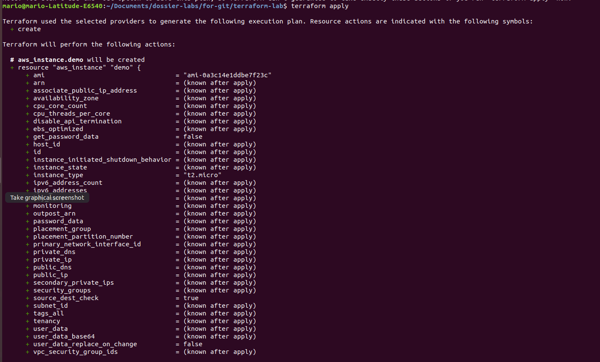

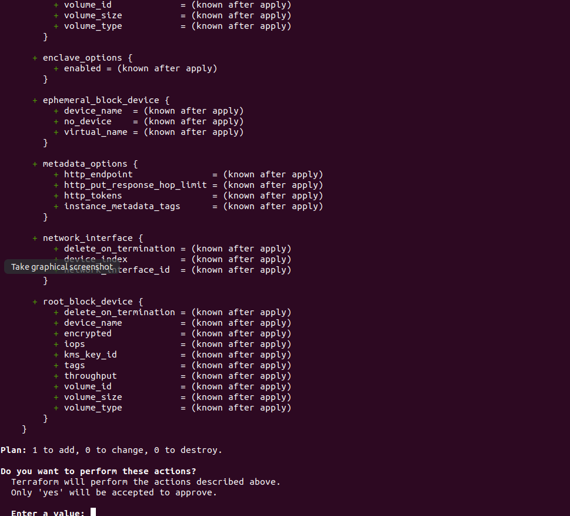

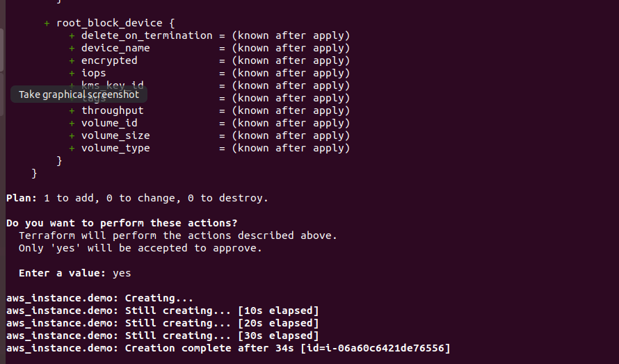

Explication: La commande **terraform init** initialise la configuration de Terraform et téléchargera le provider aws et
le rend disponible pour notre configuration Terraform. Le provider aws nous permet de créer et de gérer Amazon Web
Infrastructures de services
La commande **terraform plan** nous donne un plan de ce qui sera construit, détruit ou mis à jour 
Enfin **terraform apply** applique les changements demandés.

Si tout se passe se bien, l'instance doit s'afficher dans notre console AWS

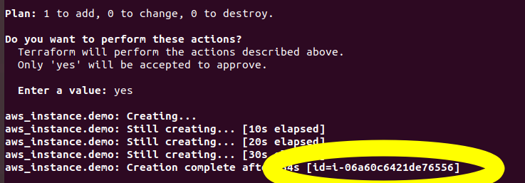  


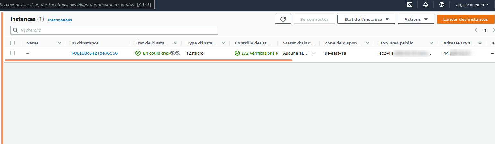